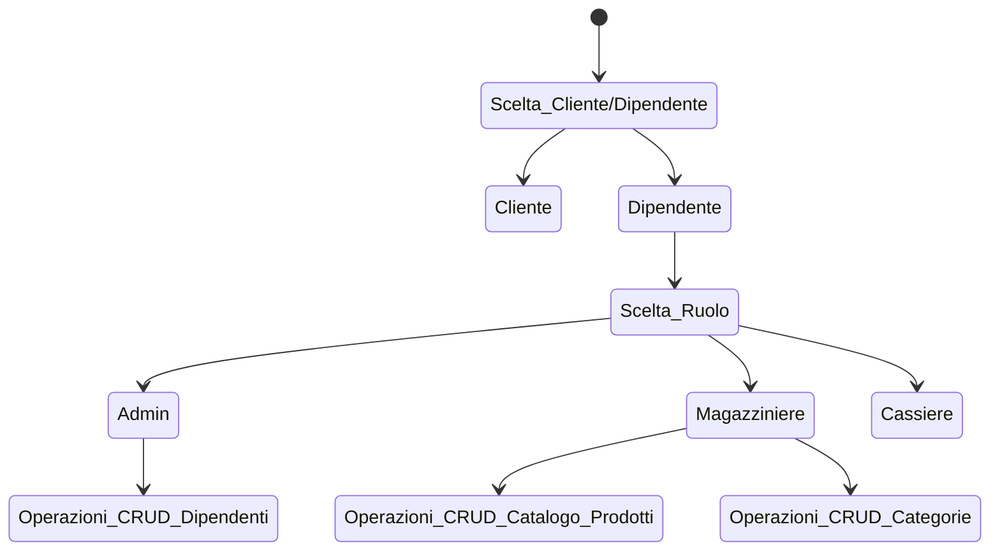

# SUPERMERCATO ADVANCED

## Classi:

|Dipendente|Tipo di dato|Note|
|---|---|---|
|ID|Int|viene generato in automatico con un progressivo|
|username|String|viene assegnato dall admin|
|ruolo|String|viene assegnato dall admin e puo essere cassiere o magazziniere|

```csharp
public class Dipendente

{
     public int IdDipendente {get;set;}
    public string Username {get;set;}
    public string Ruolo {get;set;}
}
```
---
|Cliente|Tipo di dato|Note|
|---|---|--|
|ID|int|viene generato in automatico con un progressivo|
|username|String|ognuno decide come vuole farlo|
|carrello|Prodotto[]||
|storico_acquisti|Purchases[]|viene popolato al termine di ogni acquisto|
|percentuale_sconto|int|viene incrementata a seconda del valore dello storico degli acquisti|
|credito|double|

```csharp
public class Cliente
{
    public int ID {get; set;}
    public String Username {get;set;}
    public Prodotto[] Carrello {get;set;}
    public Purchases[] storico_acquisti {get;set;}
    public double Credito {get;set;}
}
```
---
|Prodotto|Tipo di dato|Note|
|---|---|---|
|ID|int|viene generato in automatico con un progressivo|
|nome|String|viene inserito dal magazziniere|
|prezzo|double|viene inserito dal magazziniere|
|giacenza|int|viene inserito dal magazziniere|
|categoria|string|viene inserito dal magazziniere|

```csharp
public class Prodotto

{
     public int ID {get;set;}
    public string Nome {get;set;}
    public decimal Prezzo {get;set;}
    public int Giacenza {get;set;}
    public string Categoria{get;set;}
}
```
---
|Categoria|Tipo di dato|Note|
|---|---|---|
|ID|int|viene generato in automatico con un progressivo|
|Nome|String|viene inserito dal magazziniere|

```csharp
public class Categoria
{
    public int ID {get;set;}
    public string Nome {get;set;}
}
```
---
**Purchases è lo stato nel quale si trova l acquisto di un cliente. Prima di essere passato alla cassa**

- Quando viene passato allo stato `completato` la cassa puo processare lo scontrino.

|Purchases|Tipo di dato|Note|
|---|---|---|
|ID|int|viene generato in automatico con un progressivo|
|cliente|Cliente||
|prodotti|Prodotto[]|viene inserito dal cliente|
|quantita|int|viene inserita dal cliente|
|data|Date|viene generato in automatico con la data corrente (quando il cliente completa l acquisto)|
|stato|Bool|lo stato di un acquisto di default e `in corso` e puo essere modificato dal cliente in `completato` o `annullato`|

```csharp
public class Purchases
{
    public int ID {get;set;}
    public Cliente cliente {get;set;}
    public Prodotto[] prodotti {get;set;}
    public int quantita {get;set;}
    public DateOnly data {get;set;}
    public bool stato {get;set;}
}
```
---
|Cassa|Tipo di dato|Note|
|---|---|---|
|ID|int|viene generato in automatico con un progressivo|
|dipendente|Dipendente|
|acquisti|Purchases[]|
|scontrino_processato|Bool|di default e `false` e diventa `true` quando la cassa ha processato lo scontrino|

```csharp
public class Cassa 
{
    public int ID {get;set;}
    public Dipendente dipendente {get;set;}
    public Purchases[] acquisti {get;set;}
    public bool scontrino_processato {get;set;}
}
```
---
|Ruolo|Tipo di dato|Note|
|---|---|---|
|ID|int|viene generato in automatico con un progressivo|
|RuoloNome|string||


```csharp
public class Ruolo
    {
    public int ID {get;set;}
    public string ruoloNome {get;set;}
    }
```
---
**Menù:**

|Cassiere|Magazziniere|Amministratore|Cliente|
|---|---|---|---|
|puo registrare i prodotti acquistati da un cliente che ha degli acquisti in stato completato e calcolare il totale da pagare generando lo scontrino e puo ricaricare il credito del cliente quando è finito|puo visualizzare aggiungere modificare o rimuovere prodotti dal magazzino e puo gestire le categorie.|puo visualizzare ed impostare il ruolo dei dipendenti.|Può aggiungere o rimuovere prodotti e cambiare lo stato dell ordine|

## Grafico che rappresente il diagramma dall'inserimento nel magazzino al completamento dell'acquisto.


# Documentazione:

## Repository :
- [x] AcquistoRepository.cs;
- [x] CategorieRepository.cs;
- [x] ClienteRepository.cs;
- [x] DipendenteRepository.cs;
- [x] ProdottoRepository.cs;
- [x] RuoloRepository.cs;
- [ ] CassaRepository.cs;

## Manager Creati:
- [x] AcquistoManager.cs;
- [x] CategorieManager.cs;
- [x] ClienteManager.cs;
- [x] DipendenteManager.cs;
- [x] ProdottoManager.cs;
- [x] RuoloManager.cs;
- [ ] CassaManager.cs;

## Stato lavorazione attuale Main:


---
- [x] La gestione delle operazioni svolte dall'Admin sono contenute all'interno della Funzione GestioneAdmin();
<details>

```csharp
 static void GestioneAdmin(DipendenteManager managerDipendente, DipendenteRepository repositoryDipendente)
    {
        Console.WriteLine("\nBenvenuto Admin!");
        bool temp1 = true;
        while (temp1)
        {
            Console.WriteLine("\nCosa vuoi fare?\n");
            Console.WriteLine("1. Visualizza Dipendenti");
            Console.WriteLine("2. Aggiungi Dipendente");
            Console.WriteLine("3. Trova Dipendente per ID");
            Console.WriteLine("4. Aggiorna Dipendente");
            Console.WriteLine("5. Elimina Dipendente");
            Console.WriteLine("0. Salva ed Esci");
            string admin = InputManager.LeggiIntero("\nScelta:", 0, 6).ToString();
            Console.Clear();
            switch (admin)
            {
                case "1":
                    Console.WriteLine("\nDipendenti:");
                    managerDipendente.StampaDipendentiIncolonnati();
                    break;
                case "2":
                    string username = InputManager.LeggiStringa("\nUsername: ");
                    managerDipendente.AggiungiDipendente(new Dipendente { Username = username, Ruolo = selezionaRuolo() });
                    break;
                case "3":
                    int idDipendente = InputManager.LeggiIntero("\nID: ");
                    Dipendente DipendenteTrovato = managerDipendente.TrovaDipendente(idDipendente);
                    if (DipendenteTrovato != null)
                    {
                        Console.WriteLine($"\nDipendente trovato per ID {idDipendente}: {DipendenteTrovato.Username}");
                    }
                    else
                    {
                        Console.WriteLine($"\nDipendente non trovato per ID {idDipendente}");
                    }
                    break;
                case "4":
                    int idDipendenteDaAggiornare = InputManager.LeggiIntero("\nID: ");
                    string usernameNuovo = InputManager.LeggiStringa("\nUsername: ");
                    managerDipendente.AggiornaDipendente(idDipendenteDaAggiornare, new Dipendente { Username = usernameNuovo, Ruolo = selezionaRuolo() });
                    break;
                case "5":
                    int idDipendenteDaEliminare = InputManager.LeggiIntero("\nID: ");
                    managerDipendente.EliminaDipendente(idDipendenteDaEliminare);
                    break;
                case "0":
                    repositoryDipendente.SalvaDipendenti(managerDipendente.OttieniDipendenti());
                    temp1 = false; // imposto la variabile continua a false per uscire dal ciclo while
                    break;
                default:
                    Console.WriteLine("Scelta non valida. Riprovare.");
                    break;
            }
        }
    }
```
</details>

---
- [x] La gestione delle operazioni svolte dal magazziniere sono contenute all'interno della Funzione GestioneMagazziniere();

<details>

```csharp
static void GestioneMagazziniere(ProdottoManager managerProdotto, ProdottoRepository repositoryProdotto, CategoriaManager managerCategoria, CategoriaRepository repositoryCategoria)
    {
        Console.WriteLine("\nBenvenuto Dipendente!");
        bool temp2 = true;
        while (temp2)
        {
            Console.WriteLine("\nCosa vuoi fare?");
            Console.WriteLine("1. Visualizza Prodotti");
            Console.WriteLine("2. Aggiungi Prodotto");
            Console.WriteLine("3. Trova Prodotto per ID");
            Console.WriteLine("4. Aggiorna Prodotto");
            Console.WriteLine("5. Elimina Prodotto");
            Console.WriteLine("6. Visualizza Categorie");
            Console.WriteLine("7. Aggiungi Categoria");
            Console.WriteLine("8. Trova Categoria per ID");
            Console.WriteLine("9. Aggiorna Categoria");
            Console.WriteLine("10. Elimina Categoria");
            Console.WriteLine("0. Salva ed Esci");

            string dip = InputManager.LeggiIntero("\nScelta:", 0, 10).ToString();
            Console.Clear();
            switch (dip)
            {
                //stampa Prodotti
                case "1":
                    Console.WriteLine("\nProdotti:");
                    managerProdotto.StampaProdottiIncolonnati();
                    break;

                //Aggiungi Prodotto
                case "2":
                    string nomeProd = InputManager.LeggiStringa("\nNome: ");
                    decimal prezzoProd = InputManager.LeggiDecimale("\nPrezzo: ");
                    int giacenzaProd = InputManager.LeggiIntero("\nGiacenza: ");
                    managerProdotto.AggiungiProdotto(new Prodotto { Nome = nomeProd, Prezzo = prezzoProd, Giacenza = giacenzaProd, categoria = selezionaCategoria() });
                    break;

                //Trova Prodotto
                case "3":
                    int idProdotto = InputManager.LeggiIntero("\nID: ");
                    Prodotto prodottoTrovato = managerProdotto.TrovaProdotto(idProdotto);
                    if (prodottoTrovato != null)
                    {
                        Console.WriteLine($"\nProdotto trovato per ID {idProdotto}: {prodottoTrovato.Nome}");
                    }
                    else
                    {
                        Console.WriteLine($"\nProdotto non trovato per ID {idProdotto}");
                    }
                    break;

                //Aggiorna Prodotto
                case "4":
                    int idProdottoDaAggiornare = InputManager.LeggiIntero("\nID: ");
                    string nomeNuovo = InputManager.LeggiStringa("\nNome: ");
                    decimal prezzoNuovo = InputManager.LeggiDecimale("\nPrezzo: ");
                    int giacenzaNuova = InputManager.LeggiIntero("\nGiacenza: ");
                    managerProdotto.AggiornaProdotto(idProdottoDaAggiornare, new Prodotto { Nome = nomeNuovo, Prezzo = prezzoNuovo, Giacenza = giacenzaNuova, categoria = selezionaCategoria() });
                    break;

                //Elimina Prodotto
                case "5":
                    int idProdottoDaEliminare = InputManager.LeggiIntero("\nID: ");
                    managerProdotto.EliminaProdotto(idProdottoDaEliminare);
                    break;

                //Visualizza categorie
                case "6":
                    Console.WriteLine("\nCategorie:");
                    managerCategoria.StampaCategorieIncolonnati();
                    break;

                //Aggiungi Categoria
                case "7":
                    string nomeCat = InputManager.LeggiStringa("\nNome: ");
                    managerCategoria.AggiungiCategoria(new Categoria { Nome = nomeCat });
                    break;

                //Trova Categoria
                case "8":
                    int idCategoria = InputManager.LeggiIntero("\nID: ");
                    Categoria categoriaTrovata = managerCategoria.TrovaCategoria(idCategoria);
                    if (categoriaTrovata != null)
                    {
                        Console.WriteLine($"\nCategoria trovata per ID {idCategoria}: {categoriaTrovata.Nome}");
                    }
                    else
                    {
                        Console.WriteLine($"\nCategoria non trovata per ID {idCategoria}");
                    }
                    break;

                //aggiorna Categoria:
                case "9":
                    int idCategoriaDaAggiornare = InputManager.LeggiIntero("\nID: ");
                    string nomeCatNuovo = InputManager.LeggiStringa("\nNome: ");
                    managerCategoria.AggiornaCategoria(idCategoriaDaAggiornare, new Categoria { Nome = nomeCatNuovo });
                    break;

                //Elimina Prodotto
                case "10":
                    int idCategoriaDaEliminare = InputManager.LeggiIntero("\nID: ");
                    managerCategoria.EliminaCategoria(idCategoriaDaEliminare);
                    break;

                //Salva ed esci
                case "0":
                    repositoryProdotto.SalvaProdotti(managerProdotto.OttieniProdotti());
                    repositoryCategoria.SalvaCategorie(managerCategoria.OttieniCategorie());
                    temp2 = false; // imposto la variabile continua a false per uscire dal ciclo while
                    break;
                default:
                    Console.WriteLine("Scelta non valida. Riprovare.");
                    break;
            }
        }
    }
```
</details>

---
- [x] Per gestire l'inserimento delle categorie senza errori in input ho creato una Funzione selezionaCategorie() che va a pescare tutte le informazioni dalla cartella Categorie e ti permette la scelta rapida tra le Categorie disponibili;

<details>

```csharp
 static Categoria selezionaCategoria()
    {
        // Carica le categorie dal repository
        var categorie = new CategoriaManager(new CategoriaRepository().CaricaCategorie()).OttieniCategorie();

        // Se la lista delle categorie è vuota
        if (categorie.Count == 0)
        {
            Console.WriteLine("Non ci sono categorie disponibili.");
            return null; // Oppure gestisci il caso come preferisci
        }

        // Stampa la lista delle categorie
        Console.WriteLine("Seleziona una categoria: ");
        for (int i = 0; i < categorie.Count; i++)
        {
            Console.WriteLine($"{i + 1}. {categorie[i].Nome}");
        }

        // Ottieni l'input dell'utente in un range valido
        int sceltaCategoria = InputManager.LeggiIntero("Seleziona un'operazione", 1, categorie.Count);

        // Restituisci la categoria selezionata
        return categorie[sceltaCategoria - 1];
    }
```
</details>

---
- [x] Per gestire l'inserimento dei Ruoli senza errori in input ho creato una Funzione selezionaRuoli() che va a pescare tutte le informazioni dalla cartella Ruoli e ti permette la scelta rapida tra i ruoli disponibili;

<details>

```csharp
static Ruolo selezionaRuolo()
        {
            var ruoli = new RuoloManager(new RuoloRepository().CaricaRuoli()).OttieniRuoli();

            if (ruoli.Count == 0)
            {
                Console.WriteLine("Non ci sono ruoli disponibili.");
                return null;
            }

            Console.WriteLine("Seleziona un ruolo: ");
            for (int i = 0; i < ruoli.Count; i++)
            {
                Console.WriteLine($"{i + 1}. {ruoli[i].ruoloNome}");
            }

            // Ottieni l'input dell'utente in un range valido
            int sceltaRuolo = InputManager.LeggiIntero("Seleziona un'operazione", 1, ruoli.Count);

            // Restituisci la categoria selezionata
            return ruoli[sceltaRuolo - 1];
        }
```
</details>

---
- [ ] La gestione delle operazioni svolte dal cliente sono contenute all'interno della Funzione GestioneCliente();

---
## Elementi Mancanti:

- [ ] Gestione Cliente, login e operazioni varie(in Lavorazione);
- [ ] Gestione Casse e Cassiere;
- [ ] Repository e Manager Cassa;

---
## Requisiti:
- Inizializzazione vari manager (prodotto manager, cliente manager, ecc...);
- Inizializzazione vari repository (prodotto repository, cliente repository, ecc...)