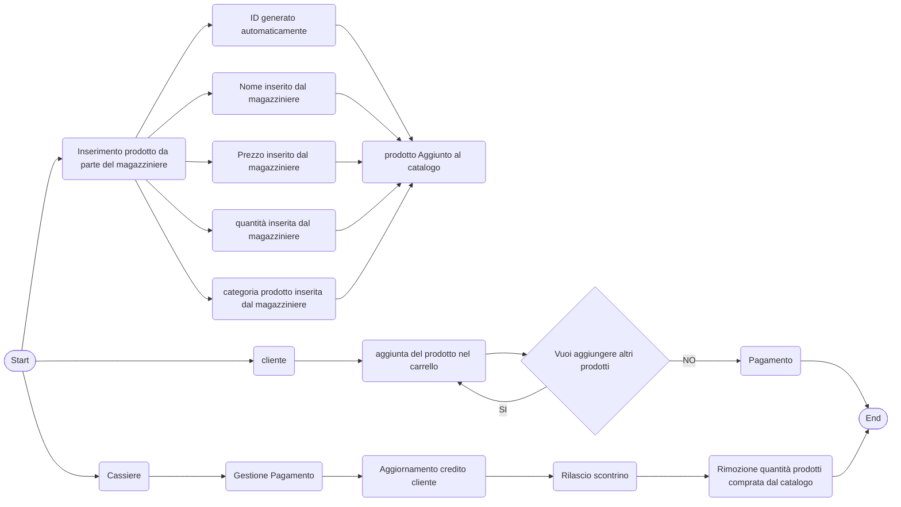

# SUPERMERCATO ADVANCED

Implementare le entita che compongono un supermercato.

---

|Dipendente|Tipo di dato|Note|
|---|---|---|
|ID|Int|viene generato in automatico con un progressivo|
|username|String|viene assegnato dall admin|
|ruolo|String|viene assegnato dall admin e puo essere cassiere o magazziniere|

```csharp
public class Dipendente

{
     public int IdDipendente {get;set;}
    public string Username {get;set;}
    public string Ruolo {get;set;}
}
```

|Cliente|Tipo di dato|Note|
|---|---|--|
|ID|int|viene generato in automatico con un progressivo|
|username|String|ognuno decide come vuole farlo|
|carrello|Prodotto[]||
|storico_acquisti|Purchases[]|viene popolato al termine di ogni acquisto|
|percentuale_sconto|int|viene incrementata a seconda del valore dello storico degli acquisti|
|credito|double|

```csharp
public class Cliente
{
    public int ID {get; set;}
    public String Username {get;set;}
    public Prodotto[] Carrello {get;set;}
    public Purchases[] storico_acquisti {get;set;}
    public double Credito {get;set;}
}
```

|Prodotto|Tipo di dato|Note|
|---|---|---|
|ID|int|viene generato in automatico con un progressivo|
|nome|String|viene inserito dal magazziniere|
|prezzo|double|viene inserito dal magazziniere|
|giacenza|int|viene inserito dal magazziniere|
|categoria|string|viene inserito dal magazziniere|

```csharp
public class Prodotto

{
     public int ID {get;set;}
    public string Nome {get;set;}
    public decimal Prezzo {get;set;}
    public int Giacenza {get;set;}
    public string Categoria{get;set;}
}
```

|Categoria|Tipo di dato|Note|
|---|---|---|
|ID|int|viene generato in automatico con un progressivo|
|Nome|String|viene inserito dal magazziniere|

```csharp
public class Categoria
{
    public int ID {get;set;}
    public string Nome {get;set;}
}
```

**Purchases è lo stato nel quale si trova l acquisto di un cliente. Prima di essere passato alla cassa**

- Quando viene passato allo stato `completato` la cassa puo processare lo scontrino.

|Purchases|Tipo di dato|Note|
|---|---|---|
|ID|int|viene generato in automatico con un progressivo|
|cliente|Cliente||
|prodotti|Prodotto[]|viene inserito dal cliente|
|quantita|int|viene inserita dal cliente|
|data|Date|viene generato in automatico con la data corrente (quando il cliente completa l acquisto)|
|stato|Bool|lo stato di un acquisto di default e `in corso` e puo essere modificato dal cliente in `completato` o `annullato`|

```csharp
public class Purchases
{
    public int ID {get;set;}
    public Cliente cliente {get;set;}
    public Prodotto[] prodotti {get;set;}
    public int quantita {get;set;}
    public DateOnly data {get;set;}
    public bool stato {get;set;}
}
```

|Cassa|Tipo di dato|Note|
|---|---|---|
|ID|int|viene generato in automatico con un progressivo|
|dipendente|Dipendente|
|acquisti|Purchases[]|
|scontrino_processato|Bool|di default e `false` e diventa `true` quando la cassa ha processato lo scontrino|

```csharp
public class Cassa 
{
    public int ID {get;set;}
    public Dipendente dipendente {get;set;}
    public Purchases[] acquisti {get;set;}
    public bool scontrino_processato {get;set;}
}
```

**Ruoli (che sarebbe il menu):**

|Cassiere|Magazziniere|Amministratore|Cliente|
|---|---|---|---|
|puo registrare i prodotti acquistati da un cliente che ha degli acquisti in stato completato e calcolare il totale da pagare generando lo scontrino e puo ricaricare il credito del cliente quando è finito|puo visualizzare aggiungere modificare o rimuovere prodotti dal magazzino e puo gestire le categorie.|puo visualizzare ed impostare il ruolo dei dipendenti.|Può aggiungere o rimuovere prodotti e cambiare lo stato dell ordine|

## Fare il grafico mermaid che rappresente il diagramma dall'inserimento nel magazzino al completamento dell'acquisto con i ruoli dei dipendenti che effettuano questa operazione.

