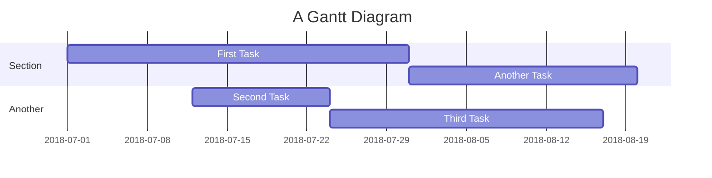

# titolo principale
## Sottotitolo 1
### titolo paragrafo
#### sottotitolo paragrafo

> esempio di quote (citazione)

esempio di __Grassetto__ o **bold**

esempio di _corsivo_

# esempio di elenco puntato
---

- primo 
    - sottoelenco
- secondo
    - sottoelenco
- terzo
- quarto
- quinto

# esempio di elenco numerato
---

1. primo
2. secondo
3. terzo
    1. quarto
    2. quinto
        1. sesto
        2. settimo
        3. ottavo
            1. nono
            2. decimo
            3. undicesimo

## esempio di Check
---

- [x] primo
- [ ] secondo
- [ ] terzo
- [x] quarto

# Esempio di codice
```

git status
git add
git commit
```

```csharp
Class Program
{
        static void Main (string[] args)
        {
            Console.WriteLine("Hello World!");
        }
}

/*
note per i collaboratori
*/
```

**esempio di link relativo**

[link GitHub](https://github.com/)

[link ad una section del documento](#esempio-di-elenco-puntato)

<!-- Commento che non compare nel render markdown -->

| Syntax | Description |
| ------------ | ------------ | 
| Header | Title |
| Paragraph | ![esempio di SVG di svg repo]|


<font color = "red"> Testo scritto in rosso!</font>

## sezioni

<details>

<summary>Tips for collapsed sections</summary>

### You can add a header

you can add text within a collapsed section

You can add an immage or a code block too

```ruby
    puts  "Hello World"
```

</details>
Here is a simple flow chart:

`
testo evidenziato
`

## GRAFICI MERMAID

https://mermaid.js.org/

https://jojozhuang.github.io/tutorial/mermaid-cheat-sheet/


## FLOWCHART BASIC


## GRAFICI GANTT

